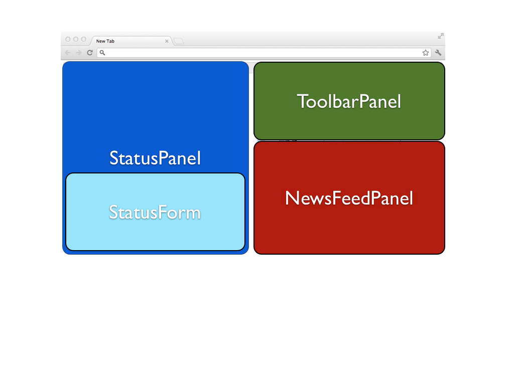

!SLIDE

# Best Practices #

!SLIDE smaller

# Namespacing #

    @@@ javascript
    window.Timesheet = {
      Models: {},
      Collections: {},
      Views: {},
      Routers: {},
      init: function() {
        Backbone.history.start();
        var statusPanel = new Timesheet.Views.StatusPanel();
        statusPanel.render();
      }
    }

!SLIDE

# Starting the App #

    @@@ javascript
    $(document).ready(function() {
      Timesheet.init();
    });

!SLIDE

# Fat Views #

* Composite View Objects
* Sub-views

!SLIDE center

!SLIDE

# Testing #

* Jasmine
* Jasmine jQuery
